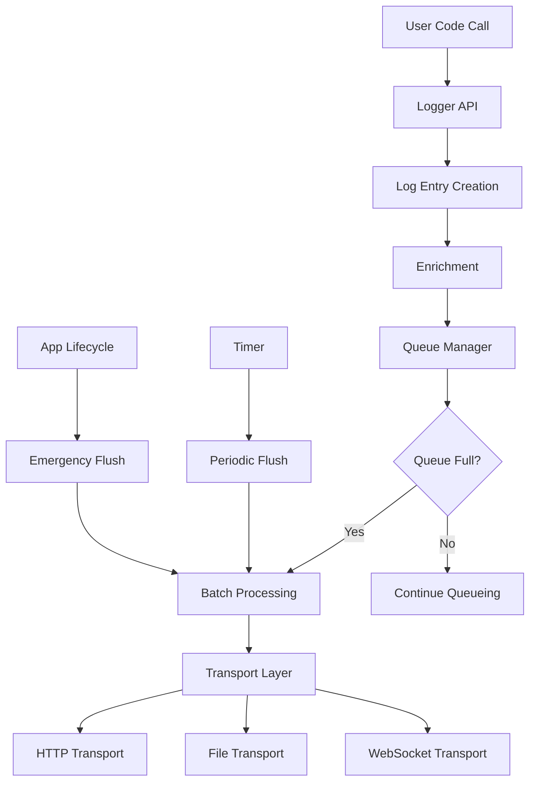

# Flutter Live Logger - Architecture Design

> **🏗️ Architecture Design Document**  
> **📅 Created**: June 2024  
> **🎯 Purpose**: Define architecture for scalable and high-performance Flutter logging solution

## 🎯 Design Goals

### Core Principles

1. **📱 Flutter-Friendly**: Natural integration with Flutter ecosystem
2. **🚀 High Performance**: Minimize main thread blocking (< 1ms)
3. **🔌 Extensible**: Plugin architecture supporting various transport methods
4. **💾 Memory Efficient**: Memory usage < 10MB
5. **🌐 Offline First**: Stable operation without network connectivity
6. **🛡️ Type Safe**: Full Dart 3.0+ null safety support

## 🏛️ Overall Architecture

```
┌─────────────────────────────────────────────────────┐
│                  Flutter App                        │
│  ┌─────────────────┐  ┌─────────────────────────┐   │
│  │  User Code      │  │   Auto Integration      │   │
│  │  - Manual logs  │  │  - Navigator Observer  │   │
│  │  - Custom events│  │  - Error Handler       │   │
│  └─────────────────┘  └─────────────────────────┘   │
└─────────────────┬───────────────┬───────────────────┘
                  │               │
                  v               v
┌─────────────────────────────────────────────────────┐
│            Flutter Live Logger Core                 │
│  ┌─────────────────────────────────────────────┐   │
│  │              Logger API                     │   │
│  │  - FlutterLiveLogger.info()                │   │
│  │  - FlutterLiveLogger.error()               │   │
│  │  - FlutterLiveLogger.event()               │   │
│  └─────────────────────────────────────────────┘   │
│  ┌─────────────────────────────────────────────┐   │
│  │           Processing Layer                  │   │
│  │  ┌─────────────┐  ┌─────────────────────┐  │   │
│  │  │   Queue     │  │    Enrichment       │  │   │
│  │  │  Manager    │  │   - Context         │  │   │
│  │  │             │  │   - Metadata        │  │   │
│  │  └─────────────┘  └─────────────────────┘  │   │
│  └─────────────────────────────────────────────┘   │
│  ┌─────────────────────────────────────────────┐   │
│  │           Transport Layer                   │   │
│  │  ┌─────────┐ ┌─────────┐ ┌─────────────┐   │   │
│  │  │  HTTP   │ │   File  │ │ WebSocket   │   │   │
│  │  │Transport│ │Transport│ │  Transport  │   │   │
│  │  └─────────┘ └─────────┘ └─────────────┘   │   │
│  └─────────────────────────────────────────────┘   │
└─────────────────┬───────────────┬───────────────────┘
                  │               │
                  v               v
┌─────────────────┴─┐           ┌─┴─────────────────────┐
│   Remote Server   │           │   Local Storage      │
│  - HTTP API       │           │  - SQLite DB         │
│  - WebSocket      │           │  - Log Files         │
│  - Real-time      │           │  - Cache             │
└───────────────────┘           └──────────────────────┘
```

## 🧱 Core Components

### 1. Logger API Layer

**Responsibility**: Provide developer-friendly API

```dart
class FlutterLiveLogger {
  // Static API - Easy access
  static void info(String message, {Map<String, dynamic>? data});
  static void error(String message, {Map<String, dynamic>? data});
  static void event(String name, Map<String, dynamic> properties);
  
  // Instance API - Advanced control
  LoggerInstance createLogger(String namespace);
}
```

**Design Features**:

- **Static Methods**: Global access for quick usage
- **Instance Methods**: Namespace-specific logging
- **Type Safety**: Leveraging generics and sealed classes

### 2. Processing Layer

**Responsibility**: Log processing, queue management, data enrichment

#### Queue Manager

```dart
class LogQueue {
  final Queue<LogEntry> _entries = Queue();
  final int maxSize;
  final Duration flushInterval;
  
  void enqueue(LogEntry entry);
  List<LogEntry> flush();
  void dispose();
}
```

**Queue Strategy**:

- **Memory Queue**: Primary storage for fast access
- **Persistent Queue**: Log preservation across app restarts
- **Batch Processing**: Grouping for network efficiency

#### Enrichment Engine

```dart
class LogEnricher {
  LogEntry enrich(LogEntry entry) {
    return entry.copyWith(
      deviceInfo: _deviceInfo,
      appInfo: _appInfo,
      userContext: _userContext,
      timestamp: DateTime.now(),
    );
  }
}
```

### 3. Transport Layer

**Responsibility**: Log transmission to various destinations

#### Plugin Architecture

```dart
abstract class LogTransport {
  String get name;
  Future<TransportResult> send(List<LogEntry> entries);
  Future<void> dispose();
}

class TransportManager {
  final List<LogTransport> _transports = [];
  
  void addTransport(LogTransport transport);
  Future<void> sendToAll(List<LogEntry> entries);
}
```

#### Implemented Transports

1. **HttpTransport**: REST API transmission
2. **WebSocketTransport**: Real-time transmission
3. **FileTransport**: Local file storage
4. **MemoryTransport**: Development/testing purposes

## 🔄 Data Flow



### Processing Steps

1. **Input**: User code log call
2. **Creation**: LogEntry object creation
3. **Enrichment**: Add metadata and context
4. **Queuing**: Temporary storage in memory queue
5. **Batching**: Create batches under certain conditions
6. **Transmission**: Parallel transmission via multiple transports
7. **Confirmation**: Verify transmission results and retry

## 🎭 Flutter Integration Strategy

### 1. Automatic Integration

```dart
class FlutterIntegration {
  // Navigator observation
  static NavigatorObserver get navigatorObserver;
  
  // Error handling
  static void setupErrorHandling();
  
  // App lifecycle
  static void setupLifecycleTracking();
}
```

### 2. Widget-Level Integration

```dart
class LoggingWidget extends StatefulWidget {
  final Widget child;
  final String screenName;
  
  // Automatically log screen entry/exit
}

// Usage
LoggingWidget(
  screenName: 'HomePage',
  child: HomePageContent(),
)
```

## 💾 Storage Architecture

### Local Storage Layer

```
┌─────────────────────────────────────┐
│            Storage Layer            │
│  ┌─────────────┐  ┌─────────────┐  │
│  │   Memory    │  │   SQLite    │  │
│  │   Queue     │  │   Database  │  │
│  │  (L1 Cache) │  │ (Persistent)│  │
│  └─────────────┘  └─────────────┘  │
│  ┌─────────────┐  ┌─────────────┐  │
│  │    File     │  │   Shared    │  │
│  │   System    │  │ Preferences │  │
│  │ (Log Files) │  │  (Config)   │  │
│  └─────────────┘  └─────────────┘  │
└─────────────────────────────────────┘
```

### Data Persistence Strategy

1. **Memory**: Fast access (max 1000 entries)
2. **SQLite**: Structured data (searchable)
3. **Files**: Large-scale log storage
4. **Preferences**: User settings preservation

## 🔄 Concurrency Model

### Isolate Utilization

```dart
class BackgroundProcessor {
  late Isolate _isolate;
  late SendPort _sendPort;
  
  // Process logs in separate isolate
  void startBackgroundProcessing() {
    _isolate = await Isolate.spawn(_backgroundWorker, receivePort.sendPort);
  }
  
  static void _backgroundWorker(SendPort sendPort) {
    // Logic running in background
    // - Batch processing
    // - Network transmission
    // - File I/O
  }
}
```

### Thread Safety

- **Lock-free Queue**: Prevent main thread blocking
- **Immutable Data**: LogEntry as immutable objects
- **Atomic Operations**: Counter and state management

## 🚀 Performance Optimization

### Memory Optimization

```dart
class MemoryManager {
  static const int MAX_QUEUE_SIZE = 1000;
  static const int MAX_MEMORY_MB = 10;
  
  // Limit memory usage with circular buffer
  void enforceMemoryLimits();
  
  // Periodic garbage collection
  void scheduleCleanup();
}
```

### CPU Optimization

- **Lazy Serialization**: JSON conversion only at transmission time
- **Batch Compression**: Save network bandwidth with gzip
- **Conditional Logging**: Early return based on log level

### Network Optimization

```dart
class NetworkOptimizer {
  // Connection pooling
  static final HttpClient _httpClient = HttpClient();
  
  // Retry logic
  static Future<void> sendWithRetry(LogBatch batch) async {
    for (int i = 0; i < 3; i++) {
      try {
        await _send(batch);
        return;
      } catch (e) {
        await Future.delayed(Duration(seconds: pow(2, i).toInt()));
      }
    }
  }
}
```

## 🧪 Testing Architecture

### Test Layers

```dart
// Unit tests
class LoggerTest extends TestCase {
  void testLogLevel();
  void testEnrichment();
  void testQueueing();
}

// Integration tests
class IntegrationTest extends TestCase {
  void testEndToEndLogging();
  void testTransportIntegration();
}

// Performance tests
class PerformanceTest extends TestCase {
  void testMemoryUsage();
  void testCPUUsage();
  void testThroughput();
}
```

### Mock System

```dart
class MockTransport extends LogTransport {
  List<LogEntry> capturedLogs = [];
  
  @override
  Future<TransportResult> send(List<LogEntry> entries) async {
    capturedLogs.addAll(entries);
    return TransportResult.success();
  }
}
```

## 🔐 Security Considerations

### Data Protection

1. **Encryption**: Sensitive data encrypted with AES-256
2. **Obfuscation**: Automatic PII data masking
3. **Permissions**: Apply principle of least privilege

### Privacy Protection

```dart
class PrivacyManager {
  // Automatic PII detection and masking
  static LogEntry sanitize(LogEntry entry) {
    return entry.copyWith(
      data: _maskSensitiveData(entry.data),
    );
  }
  
  // GDPR compliance
  static Future<void> exportUserData(String userId);
  static Future<void> deleteUserData(String userId);
}
```

## 📊 Monitoring and Diagnostics

### Built-in Metrics

```dart
class LoggerMetrics {
  static int get totalLogsGenerated;
  static int get totalLogsSent;
  static Duration get averageProcessingTime;
  static int get currentQueueSize;
  static Map<String, int> get transportStats;
}
```

### Debug Mode

```dart
class DebugMode {
  static bool isEnabled = kDebugMode;
  
  // Real-time log stream
  static Stream<LogEntry> get logStream;
  
  // Performance profiling
  static void startProfiling();
  static ProfileResult stopProfiling();
}
```

## 🔮 Scalability Plans

### Plugin Ecosystem

```dart
// Interface for community plugins
abstract class LoggerPlugin {
  String get name;
  Version get version;
  
  void initialize(LoggerConfig config);
  LogEntry? processLog(LogEntry entry);
}
```

### Future Features

1. **AI-based Log Analysis**: Pattern detection and anomaly identification
2. **Real-time Dashboard**: Flutter Web-based monitoring
3. **Cloud Integration**: Native support for AWS, GCP, Azure
4. **Multi-language Support**: Automatic log message translation

## 📈 Performance Benchmark Targets

| Metric | Target | Measurement Method |
|--------|--------|--------------------|
| Main thread blocking time | < 1ms | Microbenchmarks |
| Memory usage | < 10MB | Profiler |
| Log throughput | > 1000 logs/sec | Load testing |
| Battery impact | < 1% | Energy profiler |
| App startup time impact | < 50ms | Startup time measurement |

This architecture is designed to make Flutter Live Logger a **high-performance**, **scalable**, and **developer-friendly** logging solution. Each component is independently testable and supports various use cases through plugin architecture.
