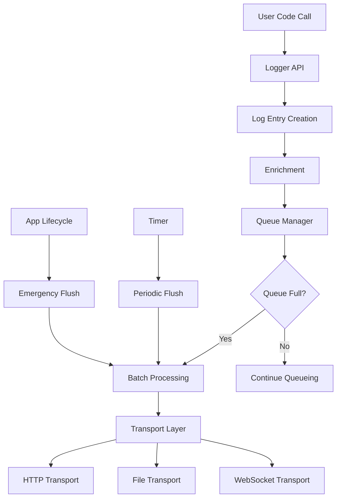

# Flutter Live Logger - Architecture Design

> **🏗️ 아키텍처 설계 문서**  
> **📅 작성일**: 2025년 6월  
> **🎯 목적**: 확장 가능하고 성능이 우수한 Flutter 로깅 솔루션 아키텍처 정의

## 🎯 설계 목표

### 핵심 원칙

1. **📱 Flutter 친화적**: Flutter 생태계와 자연스럽게 통합
2. **🚀 고성능**: 메인 스레드 차단 최소화 (< 1ms)
3. **🔌 확장 가능**: 플러그인 아키텍처로 다양한 전송 방식 지원
4. **💾 메모리 효율적**: 메모리 사용량 < 10MB
5. **🌐 오프라인 우선**: 네트워크 없이도 안정적 동작
6. **🛡️ 타입 안전**: Dart 3.0+ null safety 완전 지원

## 🏛️ 전체 아키텍처

```
┌─────────────────────────────────────────────────────┐
│                  Flutter App                        │
│  ┌─────────────────┐  ┌─────────────────────────┐   │
│  │  User Code      │  │   Auto Integration      │   │
│  │  - Manual logs  │  │  - Navigator Observer  │   │
│  │  - Custom events│  │  - Error Handler       │   │
│  └─────────────────┘  └─────────────────────────┘   │
└─────────────────┬───────────────┬───────────────────┘
                  │               │
                  v               v
┌─────────────────────────────────────────────────────┐
│            Flutter Live Logger Core                 │
│  ┌─────────────────────────────────────────────┐   │
│  │              Logger API                     │   │
│  │  - FlutterLiveLogger.info()                │   │
│  │  - FlutterLiveLogger.error()               │   │
│  │  - FlutterLiveLogger.event()               │   │
│  └─────────────────────────────────────────────┘   │
│  ┌─────────────────────────────────────────────┐   │
│  │           Processing Layer                  │   │
│  │  ┌─────────────┐  ┌─────────────────────┐  │   │
│  │  │   Queue     │  │    Enrichment       │  │   │
│  │  │  Manager    │  │   - Context         │  │   │
│  │  │             │  │   - Metadata        │  │   │
│  │  └─────────────┘  └─────────────────────┘  │   │
│  └─────────────────────────────────────────────┘   │
│  ┌─────────────────────────────────────────────┐   │
│  │           Transport Layer                   │   │
│  │  ┌─────────┐ ┌─────────┐ ┌─────────────┐   │   │
│  │  │  HTTP   │ │   File  │ │ WebSocket   │   │   │
│  │  │Transport│ │Transport│ │  Transport  │   │   │
│  │  └─────────┘ └─────────┘ └─────────────┘   │   │
│  └─────────────────────────────────────────────┘   │
└─────────────────┬───────────────┬───────────────────┘
                  │               │
                  v               v
┌─────────────────┴─┐           ┌─┴─────────────────────┐
│   Remote Server   │           │   Local Storage      │
│  - HTTP API       │           │  - SQLite DB         │
│  - WebSocket      │           │  - Log Files         │
│  - Real-time      │           │  - Cache             │
└───────────────────┘           └──────────────────────┘
```

## 🧱 핵심 컴포넌트

### 1. Logger API Layer

**책임**: 개발자 친화적인 API 제공

```dart
class FlutterLiveLogger {
  // 정적 API - 간편한 사용
  static void info(String message, {Map<String, dynamic>? data});
  static void error(String message, {Map<String, dynamic>? data});
  static void event(String name, Map<String, dynamic> properties);
  
  // 인스턴스 API - 고급 제어
  LoggerInstance createLogger(String namespace);
}
```

**설계 특징**:

- **정적 메서드**: 빠른 사용을 위한 전역 접근
- **인스턴스 메서드**: 네임스페이스별 로깅
- **타입 안전**: 제네릭과 sealed class 활용

### 2. Processing Layer

**책임**: 로그 처리, 큐 관리, 데이터 보강

#### Queue Manager

```dart
class LogQueue {
  final Queue<LogEntry> _entries = Queue();
  final int maxSize;
  final Duration flushInterval;
  
  void enqueue(LogEntry entry);
  List<LogEntry> flush();
  void dispose();
}
```

**큐 전략**:

- **메모리 큐**: 빠른 접근을 위한 1차 저장소
- **지속성 큐**: 앱 재시작 시에도 로그 보존
- **배치 처리**: 네트워크 효율성을 위한 그룹화

#### Enrichment Engine

```dart
class LogEnricher {
  LogEntry enrich(LogEntry entry) {
    return entry.copyWith(
      deviceInfo: _deviceInfo,
      appInfo: _appInfo,
      userContext: _userContext,
      timestamp: DateTime.now(),
    );
  }
}
```

### 3. Transport Layer

**책임**: 다양한 목적지로 로그 전송

#### 플러그인 아키텍처

```dart
abstract class LogTransport {
  String get name;
  Future<TransportResult> send(List<LogEntry> entries);
  Future<void> dispose();
}

class TransportManager {
  final List<LogTransport> _transports = [];
  
  void addTransport(LogTransport transport);
  Future<void> sendToAll(List<LogEntry> entries);
}
```

#### 구현된 Transport

1. **HttpTransport**: REST API 전송
2. **WebSocketTransport**: 실시간 전송
3. **FileTransport**: 로컬 파일 저장
4. **MemoryTransport**: 개발/테스트용

## 🔄 데이터 흐름 (Data Flow)



### 처리 단계

1. **입력**: 사용자 코드에서 로그 호출
2. **생성**: LogEntry 객체 생성
3. **보강**: 메타데이터 및 컨텍스트 추가
4. **큐잉**: 메모리 큐에 임시 저장
5. **배치화**: 일정 조건에서 배치 생성
6. **전송**: 여러 Transport로 병렬 전송
7. **확인**: 전송 결과 확인 및 재시도

## 🎭 Flutter 통합 전략

### 1. 자동 통합

```dart
class FlutterIntegration {
  // Navigator 관찰
  static NavigatorObserver get navigatorObserver;
  
  // 에러 핸들링
  static void setupErrorHandling();
  
  // 앱 생명주기
  static void setupLifecycleTracking();
}
```

### 2. Widget 레벨 통합

```dart
class LoggingWidget extends StatefulWidget {
  final Widget child;
  final String screenName;
  
  // 자동으로 화면 진입/이탈 로깅
}

// 사용법
LoggingWidget(
  screenName: 'HomePage',
  child: HomePageContent(),
)
```

## 💾 저장소 아키텍처

### 로컬 저장소 계층

```
┌─────────────────────────────────────┐
│            Storage Layer            │
│  ┌─────────────┐  ┌─────────────┐  │
│  │   Memory    │  │   SQLite    │  │
│  │   Queue     │  │   Database  │  │
│  │  (L1 Cache) │  │ (Persistent)│  │
│  └─────────────┘  └─────────────┘  │
│  ┌─────────────┐  ┌─────────────┐  │
│  │    File     │  │   Shared    │  │
│  │   System    │  │ Preferences │  │
│  │ (Log Files) │  │  (Config)   │  │
│  └─────────────┘  └─────────────┘  │
└─────────────────────────────────────┘
```

### 데이터 보존 전략

1. **메모리**: 빠른 접근 (최대 1000개 항목)
2. **SQLite**: 구조화된 데이터 (검색 가능)
3. **파일**: 대용량 로그 저장
4. **환경설정**: 사용자 설정 보존

## 🔄 동시성 모델 (Concurrency Model)

### Isolate 활용

```dart
class BackgroundProcessor {
  late Isolate _isolate;
  late SendPort _sendPort;
  
  // 별도 Isolate에서 로그 처리
  void startBackgroundProcessing() {
    _isolate = await Isolate.spawn(_backgroundWorker, receivePort.sendPort);
  }
  
  static void _backgroundWorker(SendPort sendPort) {
    // 백그라운드에서 실행되는 로직
    // - 배치 처리
    // - 네트워크 전송
    // - 파일 I/O
  }
}
```

### 스레드 안전성

- **Lock-free 큐**: 메인 스레드 차단 방지
- **Immutable 데이터**: LogEntry는 불변 객체
- **Atomic 연산**: 카운터 및 상태 관리

## 🚀 성능 최적화

### 메모리 최적화

```dart
class MemoryManager {
  static const int MAX_QUEUE_SIZE = 1000;
  static const int MAX_MEMORY_MB = 10;
  
  // 순환 버퍼로 메모리 사용량 제한
  void enforceMemoryLimits();
  
  // 주기적 가비지 컬렉션
  void scheduleCleanup();
}
```

### CPU 최적화

- **지연 직렬화**: 전송 시점에만 JSON 변환
- **배치 압축**: gzip으로 네트워크 대역폭 절약
- **조건부 로깅**: 로그 레벨에 따른 조기 반환

### 네트워크 최적화

```dart
class NetworkOptimizer {
  // 연결 풀링
  static final HttpClient _httpClient = HttpClient();
  
  // 재시도 로직
  static Future<void> sendWithRetry(LogBatch batch) async {
    for (int i = 0; i < 3; i++) {
      try {
        await _send(batch);
        return;
      } catch (e) {
        await Future.delayed(Duration(seconds: pow(2, i).toInt()));
      }
    }
  }
}
```

## 🧪 테스트 아키텍처

### 테스트 계층

```dart
// 단위 테스트
class LoggerTest extends TestCase {
  void testLogLevel();
  void testEnrichment();
  void testQueueing();
}

// 통합 테스트
class IntegrationTest extends TestCase {
  void testEndToEndLogging();
  void testTransportIntegration();
}

// 성능 테스트
class PerformanceTest extends TestCase {
  void testMemoryUsage();
  void testCPUUsage();
  void testThroughput();
}
```

### Mock 시스템

```dart
class MockTransport extends LogTransport {
  List<LogEntry> capturedLogs = [];
  
  @override
  Future<TransportResult> send(List<LogEntry> entries) async {
    capturedLogs.addAll(entries);
    return TransportResult.success();
  }
}
```

## 🔐 보안 고려사항

### 데이터 보호

1. **암호화**: 민감한 데이터는 AES-256으로 암호화
2. **난독화**: PII 데이터 자동 마스킹
3. **권한**: 최소 권한 원칙 적용

### 개인정보 보호

```dart
class PrivacyManager {
  // PII 자동 감지 및 마스킹
  static LogEntry sanitize(LogEntry entry) {
    return entry.copyWith(
      data: _maskSensitiveData(entry.data),
    );
  }
  
  // GDPR 준수
  static Future<void> exportUserData(String userId);
  static Future<void> deleteUserData(String userId);
}
```

## 📊 모니터링 및 진단

### 내장 메트릭

```dart
class LoggerMetrics {
  static int get totalLogsGenerated;
  static int get totalLogsSent;
  static Duration get averageProcessingTime;
  static int get currentQueueSize;
  static Map<String, int> get transportStats;
}
```

### 디버그 모드

```dart
class DebugMode {
  static bool isEnabled = kDebugMode;
  
  // 실시간 로그 스트림
  static Stream<LogEntry> get logStream;
  
  // 성능 프로파일링
  static void startProfiling();
  static ProfileResult stopProfiling();
}
```

## 🔮 확장성 계획

### 플러그인 생태계

```dart
// 커뮤니티 플러그인을 위한 인터페이스
abstract class LoggerPlugin {
  String get name;
  Version get version;
  
  void initialize(LoggerConfig config);
  LogEntry? processLog(LogEntry entry);
}
```

### 미래 기능

1. **AI 기반 로그 분석**: 패턴 감지 및 이상 탐지
2. **실시간 대시보드**: Flutter Web 기반 모니터링
3. **클라우드 통합**: AWS, GCP, Azure 네이티브 지원
4. **다국어 지원**: 로그 메시지 자동 번역

## 📈 성능 벤치마크 목표

| 메트릭 | 목표 | 측정 방법 |
|--------|------|-----------|
| 메인 스레드 차단 시간 | < 1ms | 마이크로벤치마크 |
| 메모리 사용량 | < 10MB | 프로파일러 |
| 로그 처리량 | > 1000 logs/sec | 부하 테스트 |
| 배터리 영향 | < 1% | 에너지 프로파일러 |
| 앱 시작 시간 영향 | < 50ms | 시작 시간 측정 |

이 아키텍처는 Flutter Live Logger가 **고성능**, **확장 가능**, **개발자 친화적**인 로깅 솔루션이 되도록 설계되었습니다. 각 컴포넌트는 독립적으로 테스트 가능하며, 플러그인 아키텍처를 통해 다양한 사용 사례를 지원할 수 있습니다.
